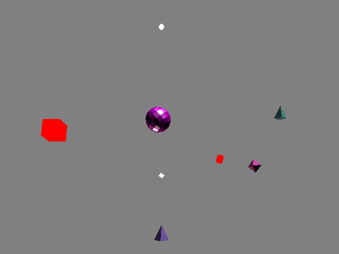

DeviceOrientation
=================

This is a sample game for the [HappyFunTimes party games system](http://greggman.github.io/HappyFunTimes).

It shows off using device orientation. It also shows using [Three.js](http://threejs.org/) with HappyFunTimes

Cloning
-------

[If you want to clone this follow the instructions here](https://github.com/greggman/HappyFunTimes/blob/master/docs/makinggames.md)

